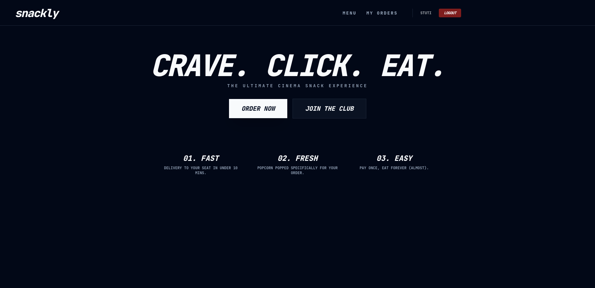
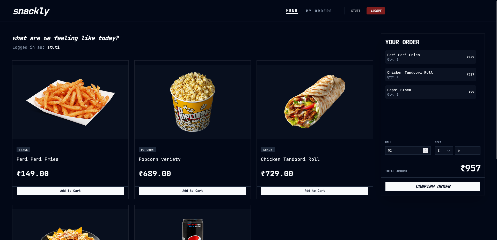
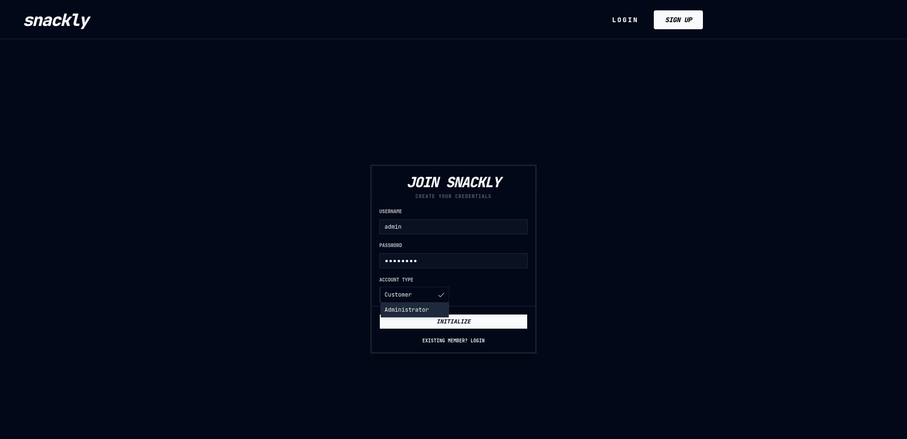
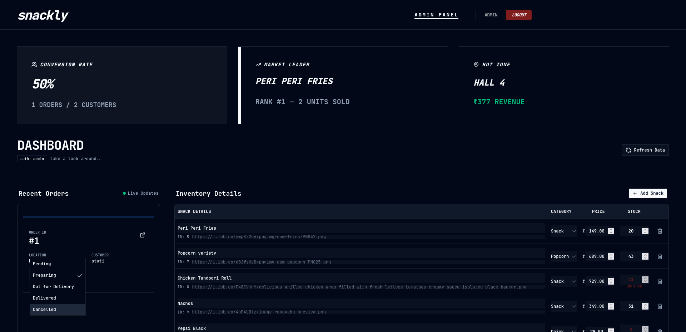

# snackly

A web-based system for ordering cinema snacks from seats. It uses a Next.js/TypeScript frontend and a Flask/MySQL backend to manage user authentication, digital menus, and order processing. The system includes an admin dashboard for inventory management and sales analytics using SQL window functions and stored procedures.

## stack 

next.js, mysql, flask

## deployment

wake this up first please!!! render https://snackly.onrender.com

after it's up n running netlify stu-snackly.netlify.app

you don't need the tidb link!

## o/p demo ss

